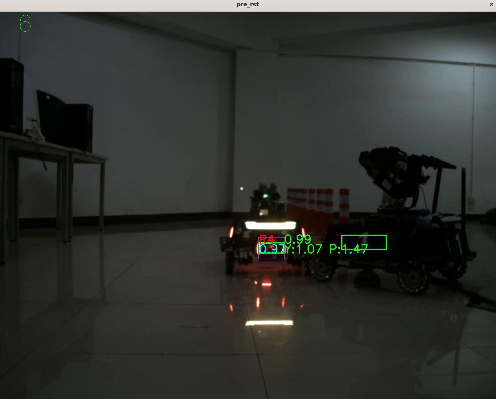

# 2024 Future RMVision

# !!!因为版本更新，下面的部署教程适用于master分支，如果只需要检测部分代码请选择tag为“v0.1”的版本下载!!!

## Tips 
- 模型使用的是沈航的，具体情况见(https://github.com/tup-robomaster/TUP-InfantryVision-2022)
- 环境部署：个人使用的是WSL2，Ubuntu也行，WSL2内核信息如下
- 默认分发：Ubuntu-20.04
  默认版本：2
  内核版本： 5.10.102.1
- 只写了检测模块，预测和击打决策希望可以给视觉的同学练手，想参与一起开发的同学联系我或者张硕钦
## 环境配置
- 因为后期会部署到NX设备上，统一为JetPack 5.1.1的软件版本，部分网址需要翻墙
- JetPack相关信息 5.1.1 (https://developer.nvidia.com/embedded/jetpack-sdk-511)
### 以下为需要在个人电脑上安装的库
- CUDA 11.4.* 安装方式见Install Guide Linux(https://docs.nvidia.com/cuda/archive/11.4.4/)
[如果已经安装了CUDA 11.*版本不用重复安装]
- cuDNN 8.6.0 安装方式见(https://docs.nvidia.com/deeplearning/cudnn/archives/cudnn-860/install-guide/index.html)
[如果已经安装了cuDNN 8.6.*版本不用重复安装]
- TensorRT 8.5.2 安装方式见(https://docs.nvidia.com/deeplearning/tensorrt/install-guide/index.html#installing-tar)
[严格安装TensorRT 8.5.2版本，即使小版本号不用，得到的推理文件也不通用]
- ps:安装完成TensorRT后，需要在`CMakeLists.txt`文件中将TensorRT的include path和library path修改为个人的安装路径
>[CMakeLists.txt:Line 24](CMakeLists.txt)
- OpenCV 4.5.4 安装方式见(https://opencv.org/get-started/)
- Eigen 安装方式：`sudo apt-get install libeigen3-dev`
- fmt 安装方式：[编译安装](https://github.com/fmtlib/fmt)
- yaml-cpp 安装方式：[编译安装](https://github.com/jbeder/yaml-cpp)
- C++ 17 g++ (Ubuntu 9.4.0-1ubuntu1~20.04.1) 9.4.0 [不严格要求g++版本] 
- cmake version 3.16.3 [不严格要求cmake版本]

## 使用方法
- 测试图片和测试用的视频在`./detector/assets/`目录下，onnx模型文件在`./detector/model`目录下，首次从onnx建立engine文件会比较慢，稍等即可
- 如果使用相机Demo，将`debug.h`的`#define USING_DAHENG`取消注释后使用`#define USING_VIDEO`宏定义

build the demo:
```shell
mkdir build
cd build
cmake ..
make
```
run demo:

```shell
./autoaim
```

检测结果如：
